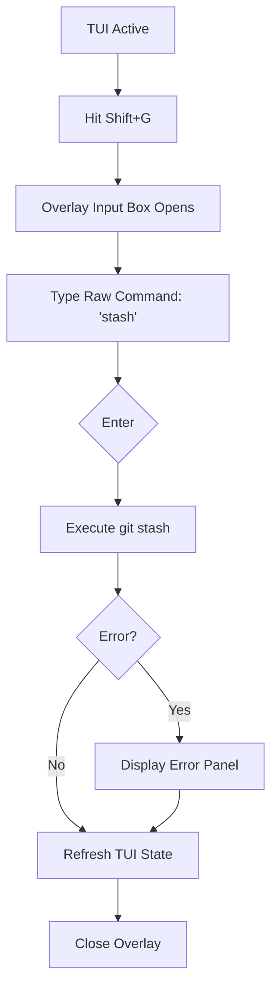

# UX Design Specification git-vibe

**Author:** sunny
**Date:** måndag 4 maj 2026

---

## Executive Summary

### Project Vision

GitVibe is a lightweight, terminal-native Git "command center" designed to bridge the gap between the raw power of the Git CLI and the visual confidence of heavy desktop GUIs. It targets developers who find IDE-integrated Git tools or external GUI applications cumbersome for frequent tasks but require a more visual, surgical approach to staging and branch management. The "Hybrid TUI" approach provides a seamless transition between high-level visual interactions and raw Git command execution.

### Target Users

The primary user is the "CLI-first Developer" (e.g., Alex), who prefers staying in the terminal for speed but finds certain Git workflows like surgical staging and branch switching tedious in the raw CLI. They value performance, visual clarity without bloat, and a "snappy" interface that respects their existing terminal workflow.

### Key Design Challenges

- **Information Density vs. Clarity:** Managing repository status with hundreds of files without overwhelming the user or sacrificing performance.
- **Hotkey Discoverability:** Ensuring the interface is lightning-fast for power users while keeping core actions (Commit, Branch, Toggle) intuitive and visible.
- **Integrated Escape Hatch:** Designing a command bar that allows for raw Git execution while ensuring the TUI state remains perfectly synced and reactive.

### Design Opportunities

- **Semantic "Vibe":** Leveraging `Spectre.Console` colors and emojis to transform dry Git status into a vibrant, readable, and "alive" interface.
- **Proactive Contextual Intelligence:** Reducing cognitive load by suggesting next steps, such as upstream tracking or post-commit pushes, based on repository state.
- **High-Velocity Staging:** Rethinking staging as a surgical, multi-select visual experience optimized for terminal-first efficiency.

## Core User Experience

### Defining Experience
The defining experience of GitVibe is **Visual Staging Mastery**. The user's primary loop is a high-speed assessment of the repository's status and the surgical selection of files to prepare a commit. This interaction must be more legible and faster than any existing CLI flag or manual staging process.

### Platform Strategy
GitVibe is a **Windows Terminal / PowerShell (TUI)** specialist. It leverages `Spectre.Console` for rich color and UTF-8 glyphs. It prioritizes keyboard interaction and ensures all icons have clear fallbacks and layouts are responsive to terminal resizing.

### Effortless Interactions
- **The Staging Toggle:** Using `Space` to toggle a file's staged state must be instantaneous, with immediate visual feedback through color changes and explicit checkbox updates.
- **The Raw Command Overlay:** Pressing `Shift+G` instantly opens a minimal text input for raw Git commands, allowing for execution and a seamless return to the TUI state.

### Critical Success Moments
The moment of success is the **"Perfect Commit"**: When a user stages a complex set of changes, verifies them with a glance at the visual indicators, and commits—all without typing a single file path.

### Experience Principles
- **Clarity over Complexity:** Use explicit checkmarks and color-coded status (Modified/Added/Deleted) to provide instant visual context.
- **Overlay-First Utility:** Raw command execution should feel like an "escape hatch" overlay, not a departure from the tool.
- **Snappy Responsiveness:** UI updates for toggles and command results must be sub-50ms to maintain the "Vibe" of a high-performance tool.

## Desired Emotional Response

### Primary Emotional Goals
The primary goal is **Surgical Confidence**. Users must feel in total control of their repository's state, experiencing a sense of precision and mastery over their staging and branching workflows. The UI should feel "nice" and modern but strictly functional, avoiding unnecessary flashiness that could distract from the task.

### Emotional Journey Mapping
- **Initial Launch:** "This is professional and focused."
- **Interaction Loop:** "I see exactly what I'm doing; I can't make a mistake."
- **Post-Action:** "That was significantly easier than the raw CLI."
- **Error/Edge Case:** "I know exactly why this failed and how to fix it via the command overlay."

### Micro-Emotions
- **Precision:** Feeling like a surgeon selecting exactly what goes into the commit.
- **Reliability:** Trusting that the TUI state is a 1:1 reflection of the underlying Git state.
- **Coolness:** The subtle satisfaction of using a high-performance, aesthetically pleasing terminal tool.

### Design Implications
- **Empowerment** → Direct mapping of keys (Space/Enter) to high-impact Git actions.
- **Trust** → Immediate UI refresh after any command execution (especially raw commands).
- **Focus** → A minimal, aligned layout that prioritizes the file list and status above all else.

### Emotional Design Principles
- **Functional Aesthetics:** Beauty comes from alignment, typography, and purposeful color, not from animation or decoration.
- **Transparent State:** Never hide the underlying Git status; make it more visible and easier to interpret.
- **Safe Exploration:** Ensure destructive actions are clear and confirmations are present where necessary, building a safety net that encourages speed.

## UX Pattern Analysis & Inspiration

### Inspiring Products Analysis
- **LazyGit:** Analyzed for its "snappy" keyboard-driven navigation and multi-pane layout. It excels at providing a high-density "dashboard" view of the repository while keeping actions just one keystroke away.
- **k9s (Kubernetes TUI):** Inspirational for its command-driven navigation and the way it handles resource lists with high performance and clear status indicators.

### Transferable UX Patterns
- **Interactive List Toggling:** Borrowing the "Space to select" pattern common in TUIs, but enhancing it with explicit visual checkboxes for "Surgical Confidence."
- **Persistent Hotkey Legend:** A bottom-aligned status bar that updates based on the current view (Files vs. Branches) to ensure users always know their next move.
- **Pane Focus:** A clear visual distinction (e.g., border color change) between the "Navigation" pane and the "Action" pane.

### Anti-Patterns to Avoid
- **Abstraction Overload:** Avoiding the trap of hiding Git too deeply. Users should always feel like they are interacting with the Git CLI, supported by the `Shift+G` escape hatch.
- **Deep Menu Nesting:** Every primary action (Commit, Push, Branch) must be a top-level hotkey to maintain the "High-Velocity" vibe.

### Design Inspiration Strategy
- **Adopt:** The multi-pane layout for constant context and the single-key navigation model for speed.
- **Adapt:** The command interface—instead of a complex command-palette, use a lightweight "Overlay" for raw Git commands (`Shift+G`) to keep the "Hybrid" promise.
- **Avoid:** Complex configuration files or deep sub-menus; keep the POC "Zero-Config" and flat.

## Design System Foundation

### 1.1 Design System Choice
The project will utilize a **Custom Component-Driven System** built on top of the **Spectre.Console** library. This approach leverages Spectre's rich terminal primitives (Layouts, Panels, Tables) to create a set of bespoke GitVibe-specific components.

### Rationale for Selection
- **Visual Branding:** Allows us to define a unique "GitVibe" aesthetic (specific color palettes and emoji sets) that differentiates it from other TUIs.
- **Consistency:** Reusable components ensure that the "File List" in the staging view and the "Branch List" in the branching view share the same interaction logic and visual language.
- **Performance:** Direct use of `Spectre.Console` ensures we stay within the "snappy" sub-200ms performance budget by avoiding heavy third-party abstractions.

### Implementation Approach
- **Atomic Components:** Standardized `GitVibe.Label`, `GitVibe.StatusBadge`, and `GitVibe.ShortcutHint` widgets.
- **Compound Components:** A `GitVibe.Dashboard` layout that manages the relationship between the sidebar and the main action pane.
- **Interaction Layer:** A centralized input handler to ensure that keys like `Space` or `Shift+G` behave consistently across the entire application.

### Customization Strategy
- **Semantic Tokens:** Define a set of "Vibe Colors" (e.g., `Vibe.Added`, `Vibe.Modified`, `Vibe.Action`) instead of hardcoding raw colors, allowing for easy theme adjustments in the future.
- **Fallback Logic:** Every component will have a "No-Emoji" or "Limited-Color" fallback to ensure the UX remains functional in less capable terminal environments.

## 2. Core User Experience

### 2.1 Defining Experience
The defining experience of GitVibe is **"The Surgical Toggle."** It transforms the often-tedious CLI staging process into a high-velocity, visual "to-do list" interaction. Users navigate a list of repository changes and use the `Space` bar to check off exactly what belongs in the next commit. This interaction provides instant visual confirmation, eliminating the need for constant `git status` double-checks.

### 2.2 User Mental Model
Users view their uncommitted changes as a collection of "tasks" or "items" that need to be sorted. Instead of thinking in file paths (the CLI model), they think in terms of **Selection and Inclusion**. They expect the TUI to behave like a modern multi-select list where the state is persistent, obvious, and highly responsive.

### 2.3 Success Criteria
- **Sub-50ms Response:** Toggling a file must feel instantaneous; any perceptible lag breaks the "Surgical" feeling.
- **Unambiguous State:** Using a combination of explicit checkboxes `[x]` and semantic colors (Green for Staged, Gray for Unstaged) to ensure 100% confidence.
- **Muscle Memory Focus:** The interaction should be so consistent that a power user can stage a complex set of files using only arrow keys and space without looking at the keyboard.

### 2.4 Novel UX Patterns
GitVibe combines the established **TUI Pane Navigation** (LazyGit-style) with a **Hybrid Command Overlay**. While the staging list is a familiar pattern, the use of `Shift+G` as a non-disruptive text-entry overlay for raw Git commands is a novel "escape hatch" that keeps the user within the TUI while granting full CLI power.

### 2.5 Experience Mechanics
1.  **Initiation:** Upon launch, the cursor is automatically placed on the first item in the "Unstaged" or "Untracked" list.
2.  **Interaction:** The user moves the cursor with `Up/Down` and toggles state with `Space`.
3.  **Feedback:** The checkbox toggles `[ ]` ↔ `[x]`, and the line's color shifts immediately (e.g., from dim modified yellow to bright staged green).
4.  **Completion:** The user hits `C` to commit, which triggers a focused message input field, followed by an optional push prompt.

## Visual Design Foundation

### Color System
The color system is **Semantic and Functional**, focused on state clarity rather than decoration.
- **Staged (Success):** Bright Green (`[green]`) + `[x]` or `✔` icon.
- **Modified (Warning):** Yellow (`[yellow]`) + `M` or `✱` icon.
- **Added/Untracked (New):** Cyan/Green (`[cyan]`) + `A` or `+` icon.
- **Deleted (Danger):** Red (`[red]`) + `D` or `✘` icon.
- **Focused Line:** Subtle background highlight or bold pointer (`>`) to clearly indicate cursor position.
- **Secondary Info:** Dimmed/Gray text for file paths and metadata.

### Typography System
Typography focuses on **Hierarchy through Weight and Glyph Selection**.
- **Active Selection:** Bold text for the focused item.
- **Status Indicators:** Explicit checkboxes `[ ]` / `[x]` provide a clear mental model.
- **Glyph Set:** A mix of ASCII-safe fallback brackets and modern UTF-8 status icons.

### Spacing & Layout Foundation
The layout uses a **Vertical Stack with Pane Separation** for high-density information.
- **Header Section:** Persistent repository name and active branch.
- **Main Action Pane:** Semi-dense list separated by "Staged" vs "Unstaged" headers.
- **Borders:** Thin `Spectre.Console` panel borders to define the work area.
- **Footer:** A persistent hotkey legend for immediate discoverability.

### Accessibility Considerations
- **Redundant Encoding:** All states are conveyed via **Color + Icon + Text** (e.g., Green + `✔` + `Staged`).
- **Clear Focus State:** The cursor position is never ambiguous, using high-contrast pointers and bold text.
- **ANSI Fallback:** Strategy for functional display in standard terminals with limited color support.

## Design Direction Decision

### Design Directions Explored
We explored three distinct TUI layouts:
- **Direction 1 (Industrial Dashboard):** A multi-pane approach focused on high-density information.
- **Direction 2 (Focused Minimalist):** A borderless, whitespace-driven layout for maximum simplicity.
- **Direction 3 (Surgical Overlay):** A centered, high-focus "Command Center" feel with explicit checkboxes and a reactive command overlay.

### Chosen Direction
The project will move forward with **Direction 3: The Surgical Overlay**. This direction prioritizes the current task (staging or branching) by using centered panels and high-contrast indicators.

### Design Rationale
- **Surgical Precision:** The centered, panel-based layout creates a "focus zone" that minimizes distraction, matching the user's mental model of "Surgical Staging."
- **Tactile Feedback:** The use of heavy borders (`╔═╗`) and explicit `[x]` checkboxes makes the digital interaction feel physical and definitive.
- **Integrated Hybridity:** This direction provides the best foundation for the `Shift+G` command overlay, as the "Command Bar" can feel like a natural extension of the centered panel.

### Implementation Approach
- **Spectre.Console Panels:** Use the `Panel` widget with `BoxBorder.Double` for the main workspace.
- **Centered Layout:** Utilize `Align.Center` to position the workspace in the middle of the terminal.
- **Overlay Simulation:** When `Shift+G` is pressed, the main panel will shrink or a second "input" panel will appear immediately below it, maintaining the centered focus.

## User Journey Flows

### The Surgical Stage (Primary Path)

Alex has 15 files changed. He wants to stage 5 specific ones and commit.

```mermaid
graph TD
    A[Launch gv] --> B{View Status List}
    B --> C[Navigate with Arrows]
    C --> D[Space to Toggle File]
    D --> E{Staged?}
    E -- Yes --> F[UI: Green + Checkbox [x]]
    E -- No --> G[UI: Gray/Yellow + [ ]]
    F --> H[Hit 'C' to Commit]
    H --> I[Input Commit Message Overlay]
    I --> J{Enter}
    J --> K[Execute git commit]
    K --> L[Prompt: Push? y/n]
    L -- y --> M[Execute git push]
    M --> N[Refresh TUI]
    L -- n --> N
```

### The Hybrid Escape Flow

Alex needs to do something the TUI doesn't support yet, like `git stash`.



### Journey Patterns
- **Action-Overlay Pattern:** Critical secondary actions (Committing, Raw Commands) are handled via centered overlays that preserve the context of the underlying list.
- **Instantaneous Feedback Pattern:** Every navigation and toggle action results in sub-50ms visual updates.

### Flow Optimization Principles
- **Minimalist Decision Matrix:** Only show information relevant to the current journey (e.g., Hide remote branch info during a local file staging journey).
- **Reduced Pathing:** Minimize the number of keystrokes required to reach "Success" (Commit/Push).

## Component Strategy

### Design System Components
The foundation of GitVibe's UI is built on **Spectre.Console** primitives:
- **`Layout`**: Manages the high-level grid and pane relationships.
- **`Panel`**: Used for the "Surgical Overlay" containers with bold, double-line borders.
- **`Table`**: Ensures column alignment for the file and branch lists.
- **`TextPrompt`**: The underlying engine for the commit message and command overlay inputs.

### Custom Components

#### `GitVibe.StagingList`
**Purpose:** High-velocity repository status management.
**Anatomy:** A table featuring `[Selection]`, `[Status Icon]`, `[Filename]`, and `[Path]`.
**Interaction:** Instant `Space` toggle between Staged (Green + `[x]`) and Unstaged (Gray/Yellow + `[ ]`).

#### `GitVibe.CommandOverlay`
**Purpose:** The "Hybrid Escape Hatch" for raw Git execution.
**Anatomy:** A centered input panel featuring a pre-filled, non-editable `git ` prefix.
**Interaction:** Triggered by `Shift+G`. User input is highlighted to differentiate it from the pre-filled command.

#### `GitVibe.StatusBar`
**Purpose:** Discoverability and global status.
**Anatomy:** A persistent footer line displaying the current branch and a context-sensitive legend of hotkeys.

### Component Implementation Strategy
- **Compositional Architecture:** Custom widgets wrap Spectre primitives to encapsulate Git-specific logic (e.g., a `GitStatus` enum driving the color/icon of a row).
- **Reactive Refresh:** Components are re-rendered based on the underlying Git repository state to ensure the UI never diverges from reality.

### Implementation Roadmap
- **Phase 1 (MVP):** `StagingList`, `StatusBar`, and `CommandOverlay` (Focus: Staging Loop).
- **Phase 2 (Growth):** `BranchList` and multi-line `CommitOverlay`.
- **Phase 3 (Polished):** Inline Diff View and repository search.

## UX Consistency Patterns

### Overlay & Modal Patterns
- **When to Use:** For any task requiring text input (commit messages, raw commands) or explicit confirmation.
- **Visual Design:** A centered `Panel` with a `Double` border that sits "on top" of the background list.
- **Behavior:** The background list is dimmed (Gray text) while the overlay is active. `Esc` always closes the overlay and returns focus to the list.

### Feedback Patterns
- **Success:** A brief, green status message in the status bar (e.g., `✔ Commit Successful`).
- **Error:** An orange/red overlay panel showing raw Git `stderr` output, requiring an explicit keypress to dismiss.
- **Selection:** Immediate "Total Staged" count updates in the header/footer upon any `Space` toggle.

### Navigation & Focus Patterns
- **Cursor UI:** A bold `>` pointer and a high-contrast background (e.g., Blue) for the active line.
- **Selection Logic:** `Space` toggles state; `Arrows` move the cursor; `Enter` executes primary action (Switch branch / Peek diff).

### Search & Filtering Patterns
- **Trigger:** Pressing `/` opens a specialized minimal input field.
- **Behavior:** The list filters in real-time as the user types, hiding non-matching files to assist in large repositories.
- **Clearing:** `Esc` clears the filter and returns to the full list.

### Empty States
- **Clean Repo:** If `git status` is empty, show a centered, friendly message: `✨ Repository is clean. Enjoy the vibe!` with prompts for alternative actions.
