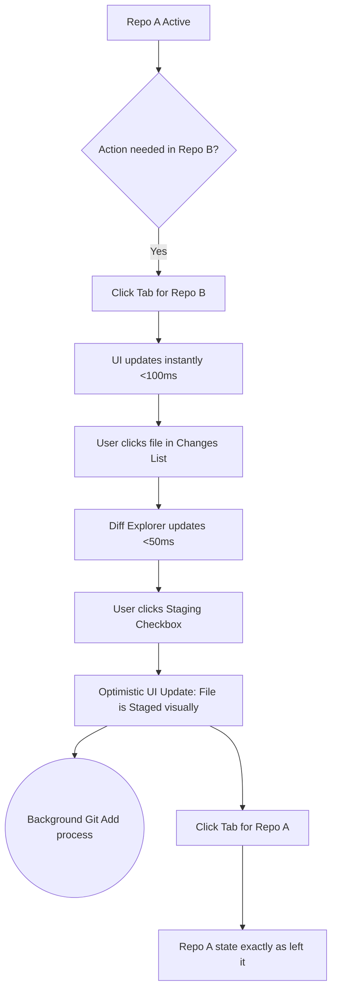
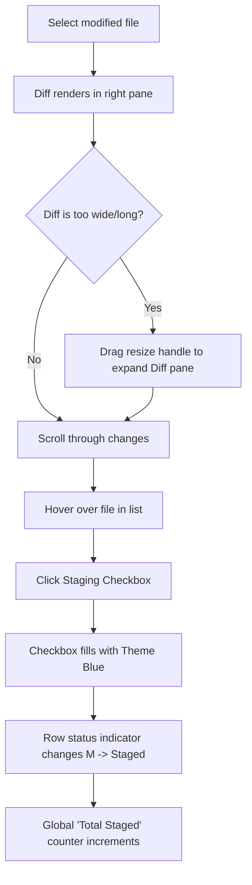

# UX Design Specification git-vibe

**Author:** sunny
**Date:** 2026-05-19

---

## Executive Summary

### Project Vision

A Hybrid Desktop App (Electron + React) that provides a surgical, visual Git staging experience. It bridges the gap between raw CLI power and visual confidence with a "High-Velocity Surgical Interface" featuring a keyboard-first, visual-always approach, multi-repo tabs, and a draggable 3-pane layout powered by shadcn/ui.

### Target Users

- **The Multi-Tasker:** Developers managing multiple microservices/repos simultaneously who need to switch contexts instantly.
- **The Surgical Auditor:** Users who want 100% certainty in staging mixed changes through high-contrast diffs and explicit checkboxes.
- **Power Users:** Tech-savvy developers who want their terminal close (integrated at the bottom) but desire a visual layer for staging/diffing.

### Key Design Challenges

- **Density vs. Clarity:** Fitting a file list, a complex diff viewer, and a functional terminal into a single window while keeping the "surgical" feel.
- **Context Switching:** Ensuring the transition between repository tabs feels instantaneous and updates all three panes without visual "flicker."
- **State Synchronicity:** Providing visual feedback (Optimistic Updates) that reflects the intent of a staging action before the Git command even finishes.

### Design Opportunities

- **The "Surgical Toggle":** Creating a highly satisfying, keyboard-accessible staging interaction (Spacebar/Click) with instant visual reinforcement.
- **Layout Fluidity:** Using `react-resizable-panels` to let users prioritize the pane they need now (e.g., 70% Diff for review, 70% Terminal for complex commands).
- **Context-Aware Terminal:** A terminal that automatically tracks the active repository and branch, reducing manual `cd` commands.

## Core User Experience

### Defining Experience

The core experience of GitVibe revolves around **"Surgical Staging and Instant Context Switching."** The absolute most frequent action is selecting a modified file, reviewing the diff, and toggling its staging state with 100% confidence. While keyboard shortcuts are supported, the primary interaction is a **precise, mouse-driven workflow** that mimics the tactile nature of checking off a list.

### Platform Strategy

GitVibe is a **Hybrid Desktop Application (Electron + React)** designed for macOS and Windows. 
- **Mouse-Primary:** The UI is optimized for precise mouse interaction, specifically for selecting files in a dense list and clicking explicit checkboxes to stage changes.
- **Keyboard-Supported:** Hotkeys (e.g., Spacebar to stage, 'C' to commit) are available as a "fast-lane" for power users, but the primary UI affordances are visual and mouse-friendly.
- **Terminal Integration:** Integrates a fully functional native terminal (xterm.js) mapped to the local file system.

### Effortless Interactions

- **Tactile Staging:** Clicking a checkbox to stage/unstage a file must reflect instantly in the UI (<50ms), providing that "done" satisfaction.
- **Zero-Flicker Tabs:** Moving between repositories must retain the exact layout, selected files, and terminal session without any load times.
- **Visual Discovery:** Simply clicking through a file list should immediately update the diff pane, making it effortless to "audit" a repository.

### Critical Success Moments

- **The Satisfying Audit:** The moment a user selects a file with complex changes, reviews the diff, and clicks the checkbox, feeling the instant state update and visual confirmation.
- **The Context Jump:** The "aha!" moment when a user successfully commits in Repo A, tabs over to Repo B, and the workspace is exactly as they left it.

### Experience Principles

- **Precision Over Speed:** Prioritize clear, clickable UI elements (like checkboxes) that give the user absolute control.
- **Visual Confidence Over Raw Output:** Use semantic colors (Red, Green, Yellow) and explicit statuses to guide the user.
- **Zero-Latency Context:** Tab switching and staging toggles must feel instantaneous.
- **Seamless Fallback:** The integrated terminal is always available for when the visual UI isn't enough, ensuring the developer never feels trapped.

## Desired Emotional Response

### Primary Emotional Goals

Users should feel **Surgically Empowered and In Control.** GitVibe should transform the often-anxious process of staging complex changes into a calm, systematic audit. The primary emotion is **Confidence**—the user knows exactly what is being staged because they can see it, touch it (via the mouse), and verify it instantly.

### Emotional Journey Mapping

- **Discovery:** "Wow, this looks like a professional command center." (Aesthetic Delight)
- **Core Action (Staging):** "I see it, I check it, it's done." (Surgical Precision & Satisfaction)
- **Error State:** "Ah, okay, I see what Git is complaining about." (Clarity & Trust, rather than Panic)
- **Completion (Commit/Push):** "Clean commit. Done." (Sense of Accomplishment)
- **Return:** "Everything is exactly where I left it." (Reliability & Ease)

### Micro-Emotions

- **Tactile Satisfaction:** The "click" of a checkbox and the instant UI update should feel as satisfying as ticking off a real-world list.
- **Visual Calm:** The high-contrast dark theme and organized 3-pane layout should reduce the "information overload" often felt in raw Git terminals.
- **Trust:** The 1:1 relationship with the Git CLI builds deep technical trust.

### Design Implications

- **Surgically Empowered** → High-contrast diffs with clear "Plus/Minus" indicators and explicit, large-hitbox checkboxes.
- **Calm & Focused** → A clean, consistent dark theme (shadcn/ui) that eliminates visual noise and prioritizes the active task.
- **Confidence & Trust** → Real-time status indicators (M, A, D) and auto-refresh logic that ensures the UI never "lies" to the user.

### Emotional Design Principles

- **Tactile Reinforcement:** Every interaction, especially the staging toggle, must provide immediate visual feedback.
- **Clarity Over Complexity:** Abstract away the confusion of raw `git status` output into semantic, color-coded visual cues.
- **The "Vibe" of Reliability:** The UI should feel like a heavy-duty tool—stable, responsive, and predictable.

## UX Pattern Analysis & Inspiration

### Inspiring Products Analysis

- **VS Code:** Specifically its source control sidebar. It does a great job of showing file statuses and provides a "staging" workflow, but its diff view can feel cramped. GitVibe learns from its **Density** and **Iconography** but solves the "cramped" feel with a flexible 3-pane layout.
- **Sublime Merge:** A masterclass in **Performance** and **Diff Clarity**. It handles massive repositories with zero lag. GitVibe aims for this level of "instant" feel, especially in context switching.
- **Linear:** Not a Git tool, but inspiring for its **Aesthetic Precision** and high-quality dark theme. Its use of subtle borders, clean typography, and purposeful spacing is what we want to emulate with shadcn/ui.

### Transferable UX Patterns

**Navigation Patterns:**
- **The "Browser Tab" for Repos:** Similar to VS Code's editor tabs or Chrome, using tabs at the top for multi-repo switching is a pattern users already understand intuitively.
- **Draggable Sidebars:** A pattern common in IDEs that gives users the power to prioritize their active task (e.g., hiding the terminal or expanding the diff).

**Interaction Patterns:**
- **Explicit Checkbox Staging:** Unlike some tools that use "Plus/Minus" icons, explicit checkboxes (similar to a todo list) provide a clearer mental model of "on/off" or "staged/unstaged."
- **Inline Highlighting:** Green/Red line-level diffing is the industry standard for code review and is a non-negotiable for "Visual Confidence."

### Anti-Patterns to Avoid

- **Hidden Modals for Staging:** Never force a user to open a dialog box to stage or commit; these should be primary, always-available interface elements.
- **Delayed Syncing:** Avoid UIs that require a manual "Refresh" to see file system changes. The UI must be reactive.
- **Over-Abstraction:** Don't hide the "Git truth." If a rebase fails, show the raw Git error rather than a generic "Something went wrong" message.

### Design Inspiration Strategy

**What to Adopt:**
- **Performance First:** Emulate Sublime Merge's sub-100ms response times for all UI actions.
- **High-Density UI:** Adopt the dense, information-rich layout of VS Code but improve it with resizable panels.

**What to Adapt:**
- **Linear-style Aesthetics:** Use shadcn/ui to achieve a premium, polished dark theme that feels more "designed" than a standard IDE.
- **Optimistic UI:** Implement state updates that feel as fast as a native C++ app, despite being a web-tech hybrid.

**What to Avoid:**
- **Generic IDE Bloat:** Avoid adding file explorers, debuggers, or extensions. Keep the focus surgically on Staging, Diffs, and Commits.

## Design System Foundation

### 1.1 Design System Choice

**shadcn/ui** (Built on Radix UI and Tailwind CSS v4).

### Rationale for Selection

- **Design Fidelity:** shadcn/ui aligns perfectly with the "Linear-style" precision identified in our inspiration phase. Its components are clean, high-density, and professional.
- **Customization:** Unlike a "heavy" component library (like Material UI), shadcn/ui provides the source code for each component. This allows us to surgically modify components (like checkboxes and tabs) to fit the unique "surgical staging" requirements without fighting a framework.
- **Accessibility:** By utilizing **Radix UI** primitives under the hood, we ensure that the complex 3-pane layout remains fully accessible to keyboard and screen-reader users.
- **Developer Experience:** It leverages Tailwind CSS v4 for ultra-fast styling and the latest CSS variable-based theming.

### Implementation Approach

We will use the **"Copy-and-Customize"** pattern. We'll initialize shadcn/ui in the Electron Renderer process and only "pull in" the components we need (Tabs, Resizable Panels, Buttons, Inputs, Checkboxes). This keeps the bundle size small and the UI performance high.

### Customization Strategy

- **Design Tokens:** We will map the CSS variables from the `@new-design` CSS file directly into the Tailwind/shadcn theme.
- **Surgical Component Overrides:** The `Checkbox` and `FileRow` components will be customized to have larger hitboxes and unique "Modified/Added/Deleted" state indicators.
- **High-Density Focus:** We will reduce default padding and margins across all shadcn components to achieve the "IDE-like" density required for managing large file lists.

## Defining Core Experience

### 2.1 Defining Experience

**"The Surgical Toggle."** 
The defining experience of GitVibe is the act of selecting a file with complex, multi-line changes, reviewing the high-contrast diff, and clicking an explicit checkbox to "stage" it. It's about turning a messy terminal output into a clear, satisfying checklist interaction where every "click" feels heavy with technical confidence.

### 2.2 User Mental Model

Users bring a **"Todo List" mental model** to this task. They view their modified files as a list of tasks that need to be "completed" (staged) before they can "close the loop" (commit). They expect:
- **Instant gratification:** Clicking the box should provide an immediate visual state change.
- **Visual Evidence:** They don't want to take the app's word for it; they want to see the "Plus/Minus" lines in the diff panel to confirm their memory.
- **Symmetry:** Unstaging should be as easy and tactile as staging.

### 2.3 Success Criteria

- **The "Sub-50ms" Rule:** The checkbox and file row status must update instantly on click, even if the underlying `git add` takes slightly longer.
- **Zero Ambiguity:** The user should never wonder "Did I stage this?" The visual difference between a staged and unstaged row must be stark and semantic.
- **No Lost Context:** If a user switches tabs, the specific file they were reviewing must remain selected when they return.

### 2.4 Novel UX Patterns

GitVibe combines **established IDE patterns** (side-by-side diffs) with a **novel "Staging Dashboard" focus**. Unlike VS Code, where staging is a side-activity, in GitVibe it is the *primary* activity. 
- We innovate by using a **multi-pane "dashboard" layout** (powered by `react-resizable-panels`) that keeps the File List, Diff Explorer, and Terminal all visible at once, eliminating the need to toggle sidebars or open new views.

### 2.5 Experience Mechanics

**1. Initiation:**
- User clicks a file row in the left-hand "Changes" panel.

**2. Interaction:**
- The right-hand "Diff Explorer" updates instantly to show the file's diff.
- User hovers over the explicit checkbox next to the filename.
- User clicks the checkbox (or presses Space).

**3. Feedback:**
- **Visual:** The checkbox fills, the row's status indicator changes (e.g., from a hollow 'M' to a solid 'M'), and a "Total Staged" counter at the bottom of the list increments.
- **Auditory/Haptic (Optional):** A subtle UI sound or "click" feel to reinforce the action.

**4. Completion:**
- The file remains in the list but is visually grouped or marked as "Staged."
- The user moves to the next file or clicks the "Commit" button at the bottom of the list.

## Visual Design Foundation

### Color System

The color system is derived directly from the provided Figma scaffold (`new-design/src/styles/theme.css` and `App.tsx`), forcing a **High-Contrast Dark Theme** specifically tuned for developer tools (like VS Code).

*   **Backgrounds:** Deep dark grays.
    *   App Background: `#1e1e1e`
    *   Panel Backgrounds (File List): `#252526`
    *   Header/Tab Bar: `#2d2d2d`
*   **Foreground/Text:** Soft whites and grays to reduce eye strain.
    *   Primary Text: `#cccccc`
    *   Active/Hover Text: `#ffffff`
    *   Muted/Secondary: `#888888`
*   **Semantic Accents (Crucial for Git):**
    *   **Modified (M):** `#4ec9b0` (Teal/Cyan)
    *   **Added (A):** `#89d185` (Green)
    *   **Deleted (D):** `#f48771` (Red/Coral)
    *   **Active Selection (Borders/Highlights):** `#007acc` (VS Code Blue)
*   **Diff Colors:**
    *   Addition Background: `#1e4620`
    *   Deletion Background: `#4b1818`

### Typography System

*   **System UI Font:** Standard system sans-serif (Inter/San Francisco/Segoe UI) for toolbars, file lists, and general UI elements. Weight: `400` normal, `500` for emphasis.
*   **Code Font:** A monospace font (e.g., Fira Code, Cascadia Code, or system default) is **mandatory** for the Diff Explorer and Terminal panes to ensure precise character alignment.

### Spacing & Layout Foundation

*   **High-Density Layout:** Padding and margins should be kept to an absolute minimum to maximize vertical screen real estate for file lists and diffs.
    *   *Example:* File rows use `py-2` (8px) padding instead of a typical `py-4` web standard.
*   **Structural Grid:** The application relies on a **3-Pane Flex/Grid Model** managed by `react-resizable-panels`.
    *   Top Left: Changes List (30% width)
    *   Top Right: Diff Explorer (70% width)
    *   Bottom: Terminal (30% height, full width)
*   **Borders:** Use subtle borders (`#3e3e3e`) to distinguish interactive areas and panes without creating visual clutter.

### Accessibility Considerations

*   **Contrast Ratios:** The semantic colors (Teal, Green, Red) against the deep gray (`#1e1e1e`) backgrounds must meet WCAG AA contrast standards. The provided hex values appear to achieve this.
*   **Keyboard Navigation:** While "mouse-primary", every interactive element (tabs, resize handles, file rows, checkboxes) must be reachable via the `Tab` key, with a clear focus ring (using the primary `#007acc` blue).

## Design Direction Decision

### Design Directions Explored

Rather than generating abstract HTML mockups, we evaluated the provided, fully functional React scaffold (`@new-design/src/app/App.tsx`). This scaffold already answers the fundamental layout and component questions with a high degree of fidelity.

### Chosen Direction

**The Scaffolded "3-Pane Flex Dashboard"**

We are officially adopting the design direction implemented in the `App.tsx` scaffold. It features:
- A Radix-powered Tab Bar at the top for repo switching.
- A vertical `PanelGroup` splitting the main workspace from the terminal.
- A horizontal `PanelGroup` splitting the Changes List (left) from the Diff Explorer (right).

### Design Rationale

- **Proven Mental Model:** The 3-pane layout perfectly matches the user's expectation of "List -> Detail -> CLI Execution." It puts all necessary context on the screen at once.
- **Flexibility:** Using `react-resizable-panels` allows the user to dynamically adjust visual weight depending on their immediate task (e.g., dragging the diff pane wider for a complex review).
- **Direct Implementation Path:** Since the scaffold is already built in React using Radix and Tailwind, it provides a 1:1 blueprint for the final Electron Renderer implementation.

### Implementation Approach

1.  **Extract Tokens:** The CSS variables from `theme.css` will be ported into the main application's Tailwind configuration.
2.  **Port the Scaffold:** The `App.tsx` structure will be ported directly into the primary layout component of the new app.
3.  **Upgrade with shadcn/ui:** We will replace the raw HTML buttons and custom tabs in the scaffold with the actual `shadcn/ui` equivalents (e.g., `Tabs`, `Button`, `ScrollArea`) to ensure consistent accessibility and hover states while maintaining the exact visual look defined in the scaffold.

## User Journey Flows

### Journey 1: The Multi-Tasker Context Switch

**Goal:** Seamlessly switch between repositories, stage a file, and switch back without losing mental context.
**Entry Point:** User has the GitVibe window open with at least two repository tabs active.

**Optimizations:** 
- The click on a new tab must never trigger a "loading spinner" over the whole app. If Git takes time to fetch status, the old cached state is shown with a subtle background refresh indicator.
- Staging a file is "fire and forget." The user doesn't wait for the Git process (I) to finish before clicking back to Repo A (J).

### Journey 2: The Surgical Diff Review

**Goal:** Review a complex file with many changes and stage it with 100% confidence.
**Entry Point:** User selects a file with a high line-change count from the Changes List.

**Optimizations:**
- The resize handle logic is fluid and live (no jumpy rendering).
- The checkbox has a deliberately larger hitbox than its visual rendering to ensure "sloppy clicks" still succeed.

### Journey Patterns

Across these flows, we establish key interaction patterns:
- **Optimistic Staging:** All UI mutations related to staging happen instantly in the Zustand store. If the Main process reports a failure, the state rolls back, and a Toast notification appears.
- **Fire and Forget Context:** Tabbing away from a view preserves scroll position, selected file, and terminal history completely.

### Flow Optimization Principles

- **Minimize Cognitive Load:** Users never wait on a progress bar for primary actions. The app always feels faster than raw CLI `git`.
- **Error Recovery:** If a background process fails (e.g., `git add` fails due to lock file), the system toasts an error and automatically re-runs `git status` to repair the UI state to match disk truth.

## Component Strategy

### Design System Components (shadcn/ui)

We will leverage the following Radix-powered components from shadcn/ui to build the foundation:
- **Tabs:** For the main repository switcher at the top of the window.
- **ScrollArea:** For the Changes List and the Diff Explorer to ensure custom, cross-platform scrollbars that match the dark theme.
- **Checkbox:** The core primitive for the "Surgical Toggle," customized heavily.
- **Button:** For standard actions like "Commit."
- **Textarea:** For the multi-line commit message input.
- **Sonner / Toast:** For global error notifications and background sync updates.

### Custom Components

The following components are highly specific to GitVibe and will be built custom (though they may wrap shadcn primitives):

#### 1. `FileRow`
**Purpose:** Represents a single file in the Changes List.
**Anatomy:** [Checkbox] + [File Icon] + [File Path] + [Status Badges (M/A/D) + Line Counts].
**States:** Default, Hover (subtle lighter gray background), Selected (blue left border, slightly lighter background).
**Interaction Behavior:** Clicking the checkbox toggles staging. Clicking anywhere else in the row selects the file and updates the Diff Explorer.

#### 2. `TerminalWrapper`
**Purpose:** Hosts the `xterm.js` instance.
**Usage:** Docked at the bottom of the main `PanelGroup`.
**Interaction Behavior:** Listens for active repository changes in Zustand and dynamically updates the PTY session or writes `cd <repo-path>` commands to stay in sync.

#### 3. `DiffLine`
**Purpose:** Renders a single line of Git diff output.
**Anatomy:** [Line Number] + [Prefix (+/-)] + [Code Content].
**Variants:** 
- `addition` (Green text, dark green background)
- `deletion` (Red text, dark red background)
- `context` (Gray text, transparent background)
- `hunk-header` (Blue text, `@@` prefix).

### Component Implementation Strategy

1. **Extract Overrides:** We will not run `npx shadcn-ui@latest add` indiscriminately. We will add components individually and immediately override their Tailwind classes to match the high-density, high-contrast tokens we defined in the Visual Foundation.
2. **Hitbox Independence:** For the `FileRow`, the visual checkbox might be 16x16px, but its interactive hitbox (padding) should be at least 24x24px to ensure the "sloppy click" optimization works.

### Implementation Roadmap

- **Phase 1 (The Shell):** Install shadcn/ui, configure Tailwind with the `@new-design` CSS tokens, and implement the `Tabs` and `react-resizable-panels` shell.
- **Phase 2 (The Lists):** Implement the custom `FileRow` and `ScrollArea`, hooking them up to dummy Zustand data.
- **Phase 3 (The Details):** Implement the `DiffLine` parser/renderer and integrate `xterm.js` into the `TerminalWrapper`.

## UX Consistency Patterns

### Button Hierarchy

To maintain focus on the "Surgical Staging" loop, we use a strict button hierarchy:
- **Primary Action (The "Commit" Button):** High-contrast blue (`#007acc`) with white text. Reserved exclusively for finishing the staging cycle.
- **Secondary Actions (e.g., "Add Repo", "Push"):** Hollow outline with primary blue or light gray border. Used for non-destructive, supporting actions.
- **Ghost Actions (e.g., "Close Tab", "Refresh"):** No background or border. Only visible on hover to reduce visual clutter in the high-density layout.

### Feedback Patterns

- **Staging Success:** Immediate visual feedback (checkbox fill + row color change). No notification needed for successful staging.
- **Commit Success:** A subtle, non-blocking Sonner toast at the bottom right: "Commit successful."
- **Critical Errors (e.g., Merge Conflict, Lock File):** A Sonner toast with a "Destructive" red variant. If the error is complex, the toast includes a "Show Details" button that opens a scrollable log.
- **In-Progress:** A subtle "pulse" animation on the repository tab icon when a background `git` command (like `git fetch`) is running.

### Form Patterns

- **Inline Commits:** The commit message area is always visible at the bottom of the Changes list. It is a borderless textarea that expands its border color to the primary blue only when focused.
- **Validation:** If a user clicks "Commit" without a message, the textarea border flashes red once, and the focus is automatically returned to the input.

### Navigation Patterns

- **Zero-Depth Tabs:** Navigation is strictly flat. Users should never have to "dive into" a menu to see their repos. Tabs at the top are the primary and only navigation mechanism.
- **Context Preservation:** Every tab maintains its own `PanelGroup` layout state. If a user hides the terminal in Repo A, it remains hidden in Repo A even if it is visible in Repo B.

### Empty States

- **No Repositories:** A central large icon with a "Drop folder here to begin" or "Open Local Repository" primary button.
- **No Changes:** A satisfying "Clean" state message: "Everything staged. Your working directory is clean."
- **No File Selected:** The Diff Explorer shows a centered placeholder icon: "Select a file to view changes."

## Responsive Design & Accessibility

### Responsive Strategy

GitVibe is a Desktop Application (Electron) where responsive design focuses on layout fluidity and information density. We utilize a 3-Pane Flex Dashboard (Files, Diff, Terminal) powered by `react-resizable-panels`. Extra screen real estate is used to expand the Diff Explorer horizontally for side-by-side reviews and the Changes List vertically for large repositories.

### Breakpoint Strategy

- **Compact Mode (< 1000px):** The Changes List collapses or narrows, prioritizing the Diff Explorer.
- **Standard Mode (1024px - 1440px):** Default balanced 30/70 split between Files and Diffs.
- **Ultra-Wide Mode (> 1920px):** Supports optional 3-column views (Files | Diff | Commit History) to leverage massive display space.

### Accessibility Strategy

- **WCAG Level AA Compliance:** Target industry standard accessibility.
- **Color Contrast:** High-contrast semantic colors (Teal, Green, Red) tuned for dark themes.
- **Keyboard-First Workflow:** Full support for Spacebar (Stage), Cmd/Ctrl+Enter (Commit), and Arrow Key navigation.
- **Screen Reader Support:** Semantic ARIA labels for file statuses and optimistic UI updates.
- **Focus Indicators:** High-visibility focus rings using the primary theme blue.

### Testing Strategy

- **Automated Checks:** Integration of `axe-core` for accessibility linting.
- **Manual Audits:** Periodic "Keyboard-Only" workflow validations.
- **Visual Simulation:** Color blindness testing to ensure +/- indicators are clear without color reliance.

### Implementation Guidelines

- **Semantic HTML:** Use proper tags (<button>, <nav>) to ensure accessibility.
- **Focus Management:** Utilize Tailwind's `focus-visible` for consistent interaction cues.
- **Relative Typography:** Use `rem` units to respect OS font scaling preferences.
